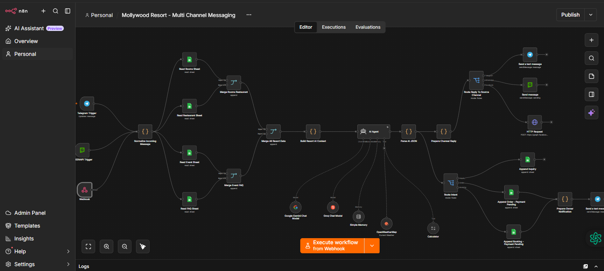

# 🤖 Multi-Channel & Voice AI Receptionist Automation Workflow

An end-to-end **Multi-Channel & Voice AI Receptionist Workflow** engineered with **n8n**, **Gemini AI**, and **Voice Speech-to-Text Pipeline**. Built for hospitality and service industries (specifically customized for **Mollywood Resort**), this system operates 24/7 across **WhatsApp, Facebook Messenger, Instagram DM, Telegram, and Voice Notes/Calls** to handle room bookings, dining orders, customer inquiries, and real-time database synchronization without human intervention.

---

## 📸 Workflow Architecture

---

## 🔥 Key Features

### 🎙️ 1. Multilingual Voice & Speech Processing
* **Voice Note & Call Automation:** Converts incoming voice messages (Bangla, English, Banglish) into text via Speech-to-Text (STT) models.
* **Contextual Voice Response:** Synthesizes natural audio replies for voice inquiries alongside text responses.

### 💬 2. Unified Multi-Channel Messaging
* **Cross-Platform Integration:** Single n8n routing engine handles WhatsApp (GreenAPI), Facebook Messenger, Instagram DM, and Telegram API.
* **Smart Intent Recognition:** Dynamically categorizes customer intents into `booking`, `order`, or `general_faq`.

### 🗓️ 3. Dynamic Date & Timestamp Standardizer
* Resolves relative conversational expressions (e.g., *"পরশু রাত ৮টায়"*, *"tomorrow afternoon"*) into standardized database ISO formats (`YYYY-MM-DD HH:mm AM/PM`).
* Prevents scheduling overlaps and timezone mismatch errors in backend records.

### 📊 4. Database Persistence & Admin Alert System
* **Google Sheets Sync:** Automatically logs validated customer info (Name, Phone, Email, Requested Items/Rooms, Date) into Google Sheets.
* **Real-time Telegram Notifications:** Triggers instant, unbranded alert cards directly to the resort manager's Telegram bot upon order or reservation placement.

### 🛡️ 5. Robust Fallback & Guardrails
* Asks clarifying questions if required parameters (e.g., Phone number or Check-in date) are missing instead of writing incomplete `N/A` records.

---

## 🛠️ Tech Stack

* **Workflow Orchestration:** [n8n](https://n8n.io)
* **LLM & Reasoning Engine:** Google Gemini AI / OpenAI API
* **Speech-to-Text / Voice AI:** Whisper API / Gemini Multimodal Voice Processing
* **Messaging APIs:** GreenAPI (WhatsApp), Meta Graph API (Messenger/Instagram), Telegram Bot API
* **Data Storage:** Google Sheets API
* **Scripting Language:** JavaScript (Node.js syntax inside n8n Code Nodes)

---

## 📐 System Pipeline Flow
